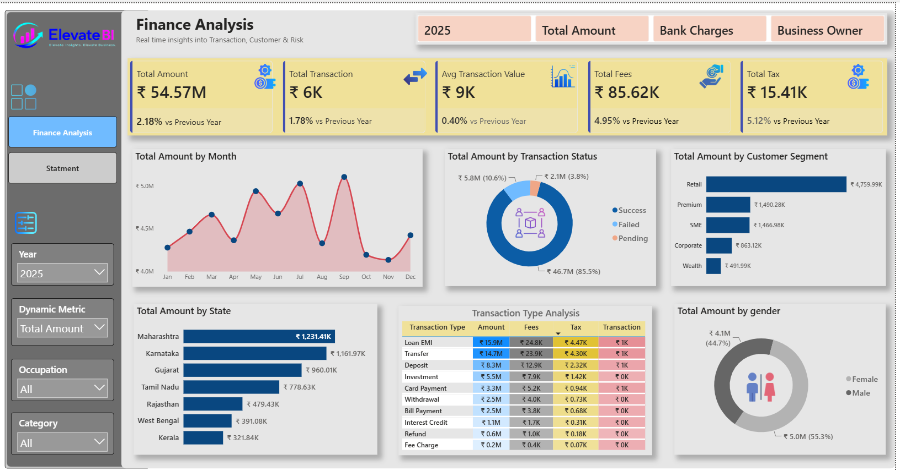
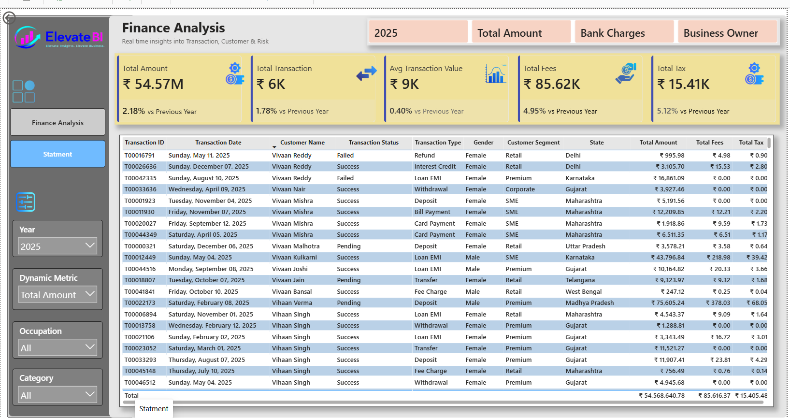

# Financial-Analysis-Dashboard-Power-Bi
Interactive Financial Analysis Dashboard built using Power BI to monitor transaction performance, customer segments, state-wise revenue, fees, taxes, and financial KPIs with dynamic filtering and drill-down analysis.
# 💰 Financial Analysis Dashboard | Power BI
An interactive **Financial Analysis Dashboard** developed using **Microsoft Power BI** to monitor financial performance, customer transactions, taxes, banking fees, customer segments, and regional insights through dynamic and interactive visualizations.
---
## 📌 Project Overview
This project provides a comprehensive financial reporting solution that enables stakeholders to analyze key financial metrics, monitor transaction performance, and identify business trends. The dashboard is designed with an executive-friendly interface and includes dynamic filtering, KPI cards, trend analysis, and detailed transaction reporting.
---
# 📷 Dashboard Preview
## Finance Analysis Dashboard

---
## Statement Report

---
# 🎯 Business Problem
Financial organizations process thousands of transactions daily. Without an interactive reporting system, it becomes difficult to:
- Monitor financial performance
- Track transaction success and failures
- Analyze customer segments
- Identify top-performing regions
- Monitor banking fees and taxes
- Support data-driven business decisions
This dashboard centralizes financial reporting into a single interactive solution.
---
# 📊 Dashboard Pages
## 1️⃣ Finance Analysis
Executive dashboard containing:
- KPI Cards
- Monthly Revenue Trend
- Transaction Status Analysis
- Customer Segment Analysis
- State-wise Performance
- Transaction Type Analysis
- Gender Analysis
- Interactive Filters
---
## 2️⃣ Statement Report
Detailed transaction-level report including:
- Transaction ID
- Transaction Date
- Customer Name
- Transaction Status
- Transaction Type
- Customer Segment
- Gender
- State
- Total Amount
- Total Fees
- Total Tax
---
# 📈 Key Performance Indicators (KPIs)
| KPI | Value |
|------|-------|
| Total Amount | ₹54.57M |
| Total Transactions | 6K |
| Average Transaction Value | ₹9K |
| Total Fees | ₹85.62K |
| Total Tax | ₹15.41K |
---
# 📊 Dashboard Features
- Executive KPI Cards
- Interactive Slicers
- Monthly Trend Analysis
- Transaction Status Distribution
- Customer Segment Analysis
- State-wise Financial Analysis
- Transaction Type Matrix
- Gender Distribution
- Detailed Statement Table
- Dynamic Metric Selection
---
# 💡 Business Insights
### 💰 Financial Performance
- Total financial transactions exceed **₹54.57 Million**.
- Average transaction value is approximately **₹9K**.
### ✅ Transaction Status
- The majority of transactions are successfully completed.
- Failed and pending transactions represent only a small percentage.
### 👥 Customer Segments
- Retail customers contribute the highest transaction value.
- Premium and SME customers are the next largest contributors.
### 🌍 Regional Analysis
Top-performing states include:
- Maharashtra
- Karnataka
- Gujarat
- Tamil Nadu
These states contribute significantly to the overall transaction amount.
### 💳 Transaction Types
Highest
- Loan EMI
- Transfer
- Deposit
- Investment
### 👨‍💼 Gender Analysis
The transaction amount is relatively balanced between male and female customers, with a slight difference in overall contribution.
---
# 📂 Dataset Information
The dashboard is built using transactional financial data containing:
- Transaction ID
- Transaction Date
- Customer Name
- Transaction Status
- Transaction Type
- Customer Segment
- Gender
- Occupation
- Category
- State
- Total Amount
- Total Fees
- Tax
---
# 🧹 Data Preparation
The dataset was transformed using **Power Query**, including:
- Removing duplicate records
- Handling missing values
- Formatting date columns
- Correcting data types
- Renaming columns
- Cleaning inconsistent values
---
# 🗂 Data Modeling
Implemented using a structured data model including:
- Fact Table
- Dimension Tables
- Date Table
- Relationships
- Star Schema
---
---
# 🛠 Tools & Technologies
- Microsoft Power BI
- Power Query
- DAX
- Microsoft Excel
- Data Modeling
- Data Visualization
---
# 🚀 Skills Demonstrated
- Data Cleaning
- Data Transformation
- Data Modeling
- DAX Calculations
- Financial Analysis
- Dashboard Design
- Business Intelligence
- KPI Development
- Interactive Reporting
- Data Storytelling
---
# 📈 Business Impact
This dashboard helps organizations:
- Monitor financial performance in real time
- Analyze customer transaction behavior
- Identify high-performing regions
- Track banking fees and taxes
- Improve operational visibility
- Support strategic decision-making
---
# 📁 Repository Structure
```
financial-analysis-dashboard-powerbi/
│
├── Dashboard/
│   └── Financial.pbix
│
├── Dataset/
│   ├── Finance_transaction.xlsx
│   └── customer.xlsx
├── Images logo/
|   ├── icon
|
├── Dashboard Images/
│   ├── finance-analytics-powerbi.png
│   ├── statement-page.png
│
├── README.md
├── LICENSE
```
---
# 📌 Project Highlights
- Interactive Financial Dashboard
- Professional UI/UX
- Multi-page Reporting
- Dynamic Filtering
- Financial KPI Tracking
- Customer Analytics
- Geographic Analysis
- Executive Reporting
---
# 👨‍💻 Author
Pradeep Chaudhary
---
LinkedIn Link: https://www.linkedin.com/in/pradeep-chaudhary-714555328/?skipRedirect=true
---

If you found this project useful or have suggestions for improvement, feel free to connect with me on **LinkedIn** or explore more of my projects on **GitHub**.
⭐ If you like this project, don't forget to **Star** the repository!
